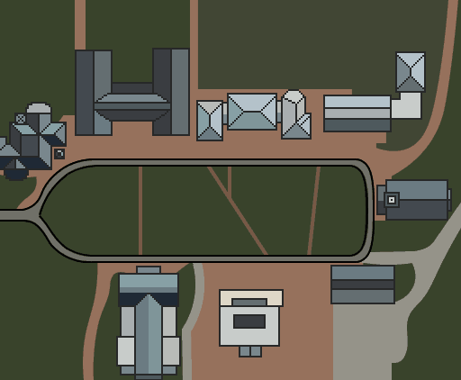

<!-- ```
arm-none-eabi-gdb Gameboy.elf
target remote 192.168.1.4:2345
```
`if\s*\([^)]*\)\n\s*\{` -->

# GBA Game Development
*Defend The Mall* is a game developed for the [Game Boy Advance (GBA)](https://en.wikipedia.org/wiki/Game_Boy_Advance) using the C programming language and the [Tonc v1.4.2](https://www.coranac.com/tonc/text/toc.htm) library. This project was a continuation of a [Scratch Game](https://scratch.mit.edu/projects/333222819/) developed my sophomore year at Wabash College.

<div align="center">
    
    <div> Figure 1: Screenshot of main screen</div>
</div>

The goal of the game is to defend the center of the Wabash College campus (known as the mall) of Wabash College from an attack of squirrels. The reasons for their attack is unclear but their aim is to destroy every building on campus. You must stop them by throwing apples at them. There are two types of enemies: Purple squirrels attack the player character and Orange squirrels attack the campus buildings. Hitting a squirrel will cause it to despawn and increase the player score by a value of 1. 

<div align="center">
    
    <div> Figure 2: Screenshot of gameplay</div>
</div>

There are 8 buildings you need to protect: Baxter, Center, Chapel, Detchon, Goodrich, Hays, Lilly, and Sparks. Orange squirrels will do damage to buildings but the buildings can be repaired at the cost of user score points. Being hit by a purple squirrel will cost the player 1 score point. If the player runs out of score points: **GAME OVER**. There is no real way to win the game yet but the goal is see how far you can get.

<div align="center">
    
    <div> Figure 3: Game Map</div>
</div>

A player may also view a mini-map to see the health of each building at any time. When a building reaches a value less than 0 the building is despawned. If all buildings are despawned: **GAME OVER**.

<div align="center">
    
    <div> Figure 4: Game Map</div>
</div>

## How to Play
This game can be played through emulation or original hardware. You will first need to download the compiled ROM file [Gameboy.gba](https://github.com/kahleeeb3/Gameboy/raw/main/Gameboy.gba). You can then play by using either:
1. An Emulator of your choice. I prefer the [mGBA](https://mgba.io/) emulator.
2. A ROM loader cartridge such as the [EZ-FLASH OMEGA](https://www.ezflash.cn/product/omega/)

<div align="center">
    
    <div> Figure 5: Gameplay preview</div>
</div>

## Controls
**A** - Throw an Apple

**B** - Repair Building (While standing over it)

**R** - View Minimap

**Up** - Move Upward

**Down** - Move Downward

**Left** - Move Left

**Right** - Move Right

These controls can be translated for emulation using the following scheme:

<div align="center">
    
    <div> Figure 6: PC Control Scheme</div>
</div>
